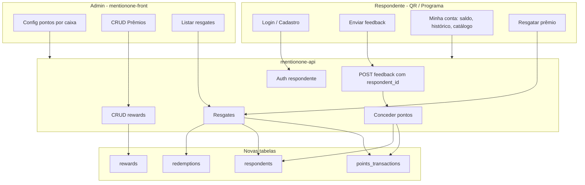

# Plano: Sistema de Pontos e Recompensas

## Contexto atual

- **Feedbacks** são anônimos: tabela `feedbacks` em [mentionone-api/src/migrations/20251125140500_create_feedback_table.ts](mentionone-api/src/migrations/20251125140500_create_feedback_table.ts) não possui vínculo com nenhum “respondente”.
- **Empresa** é identificada por subdomínio ([EnterpriseGetInfo](mentionone-api/src/middleware/EnterpriseGetInfo.ts)); rotas em [customer.routes.ts](mentionone-api/src/routes/customer.routes.ts) expõem `POST /customers/feedbacks` e `GET /customers/feedback-options/box/slug/:slug` sem autenticação do respondente.
- **Auth existente** é para usuários admin (JWT com user + enterprise); login em [auth.routes.ts](mentionone-api/src/routes/auth.routes.ts) usa `EnterpriseGetInfo` e retorna token + user.

Para a feature funcionar é necessário:

1. Identificar **quem** está respondendo (respondente) para acumular pontos.
2. Permitir **login/cadastro** do respondente no contexto da empresa (subdomínio).
3. Configurar **por caixa** se cada cliente pode responder uma ou mais vezes e quantos pontos ganha.
4. Cadastrar **prêmios** (produtos/serviços/descontos) e permitir **resgate** em troca de pontos.

---

## Arquitetura proposta

---

## 1. Modelo de dados (API)

### 1.1 Respondentes (programa de fidelidade por empresa)

- **Tabela `respondents**`: `id`, `enterprise_id`(FK),`email`, `password_digest`, `name`(opcional),`points_balance`(int, default 0),`created_at`, `updated_at`.
- **Unicidade**: `(enterprise_id, email)` único — um e-mail por programa por empresa.
- **Observação**: Não reutilizar a tabela `users` com `access_level: customer`; o conceito é distinto (consumidor final do programa da empresa vs usuário do painel).

### 1.2 Configuração de pontos por caixa

- **Alterar tabela `boxes**`(migration): adicionar`points_enabled`(boolean, default false),`points_per_response`(int, default 0),`allow_multiple_responses` (boolean, default true).
- Quando `points_enabled` for true e o feedback for enviado por um respondente autenticado, a API concede pontos (respeitando `allow_multiple_responses` por caixa).

### 1.3 Vínculo feedback ↔ respondente

- **Alterar tabela `feedbacks**`: adicionar `respondent_id`(FK para`respondents`, nullable).
- Feedback anônimo: `respondent_id` null (não gera pontos). Feedback com respondente logado: preencher `respondent_id` e aplicar regra de pontos da caixa.

### 1.4 Prêmios (rewards)

- **Tabela `rewards**`: `id`, `enterprise_id`, `type`enum ('product','service','discount'),`name`, `description`(opcional),`points_cost`, `image_url`(opcional),`stock`(int nullable; null = ilimitado),`active`(boolean, default true),`created_at`, `updated_at`.
- Para tipo `discount`: opcionalmente `discount_type` ('percentage'|'fixed'), `discount_value` para exibir no resgate (ex.: “10% off” ou “R$ 5 off”).

### 1.5 Resgates e histórico de pontos

- **Tabela `redemptions**`: `id`, `respondent_id`, `reward_id`, `points_spent`, `status`enum ('pending','completed','cancelled'),`created_at`, `updated_at`.
- **Tabela `points_transactions**`: `id`, `respondent_id`, `amount`(positivo = ganho, negativo = gasto),`type`enum ('earn','spend'),`reference_type`('feedback','redemption'),`reference_id`, `created_at`. Permite histórico e auditoria; saldo = soma de `amount`por respondente (ou cache em`respondents.points_balance` atualizado nas transações).

---

## 2. Autenticação do respondente (API)

- **Novas rotas** (sob prefixo que use `EnterpriseGetInfo`, ex.: rotas em `customer.routes.ts` ou novo `respondent.routes.ts`):
  - `POST /customers/register`: body `{ email, password, name? }`; empresa via subdomínio; cria `respondents` com senha hasheada (mesmo BCrypt do projeto); retorna token + dados do respondente (sem senha).
  - `POST /customers/login`: body `{ email, password }`; valida contra `respondents` da empresa; retorna JWT + dados do respondente.
  - `GET /customers/me`: rota protegida por middleware “RespondentAuth”; retorna perfil + `points_balance` (e opcionalmente últimas transações).
- **JWT do respondente**: payload com `respondentId`, `enterpriseId` e um claim tipo `type: 'respondent'` para não confundir com o JWT de usuário admin. Middleware que lê o token e seta `request.respondent_id` e `request.enterprise_id` (ou valida enterprise_id contra subdomínio).
- **Segurança**: rate limit em register/login; validação de e-mail e senha (ex.: Zod); senha com requisitos mínimos (ex.: 8 caracteres).

---

## 3. Regras de negócio: concessão de pontos (API)

- Ao criar feedback (`POST /customers/feedbacks`):
  - Se a caixa tiver `points_enabled === false`: não conceder pontos; pode aceitar `respondent_id` opcional (para histórico) ou ignorar.
  - Se `points_enabled === true` e não houver respondente autenticado: não conceder pontos (opcional: retornar mensagem “Faça login para ganhar pontos”).
  - Se `points_enabled === true` e houver respondente autenticado:
    - Se `allow_multiple_responses === false`: verificar se já existe feedback com esse `respondent_id` e `box_id`; se existir, não conceder pontos.
    - Caso contrário: criar `points_transaction` (earn, `points_per_response`), atualizar `respondents.points_balance`, e salvar `respondent_id` no feedback.
- Manter feedback anônimo permitido: quando pontos não estão habilitados na caixa, não exige login.

---

## 4. Prêmios e resgates (API)

- **CRUD de prêmios** (rotas protegidas por admin + `EnterpriseGetInfo`): criar, listar, editar, desativar rewards da empresa (listagem para respondente só retorna `active = true`).
- **Catálogo para respondente**: `GET /customers/rewards`: lista rewards ativos da empresa (subdomínio), com `points_cost`, `stock` (se houver), tipo e nome.
- **Resgate**: `POST /customers/redeem`: body `{ reward_id }`; middleware RespondentAuth. Validar: reward ativo, `points_balance >= points_cost`, estoque (se aplicável); criar `redemptions` (status pending ou completed), criar `points_transaction` (spend), decrementar `points_balance` e, se houver, `rewards.stock`.

---

## 5. Frontend (mentionone-front)

### 5.1 Admin

- **Configuração por caixa**: na edição/criação de caixa (ou em seção “Programa de pontos”), campos: ativar pontos (sim/não), pontos por resposta, permitir múltiplas respostas (sim/não). Persistir via API (boxes com novos campos).
- **CRUD de prêmios**: nova área “Prêmios” (menu): listagem, formulário (tipo: produto/serviço/desconto, nome, descrição, custo em pontos, estoque opcional, imagem opcional, ativo). Chamadas às rotas admin de rewards.
- **Resgates**: lista de resgates da empresa (respondente, prêmio, pontos, status, data); opcional: marcar como “entregue” (status completed).

### 5.2 Fluxo do respondente (QR / programa)

- **Página QR** ([app/qr/[slug]/page.tsx](mentionone-front/app/qr/[slug]/page.tsx)): se a caixa tiver `points_enabled`, exibir opção “Entrar” / “Cadastrar” (ou link “Já tem conta? Ganhe pontos ao responder”). Após login/registro, enviar feedback com token (API associa `respondent_id` pelo JWT). Mensagem de sucesso: “Obrigado! Você ganhou X pontos.”
- **Login/Cadastro do respondente**: telas/modal em contexto da empresa (mesmo subdomínio do QR); após sucesso, guardar token do respondente (ex.: localStorage ou cookie, com mesmo cuidado de segurança que o admin) e redirecionar ou fechar modal.
- **Área “Minha conta” / “Meus pontos”**: acessível quando logado como respondente (ex.: `/program` ou `/minha-conta` no mesmo front, ou link na thank-you page). Conteúdo: saldo atual, histórico de pontos (ganhos/resgates), catálogo de prêmios, botão “Resgatar” que chama `POST /customers/redeem` e atualiza saldo/histórico.

---

## 6. Melhorias sugeridas para a feature

- **Expiração de pontos**: campo opcional na empresa ou no plano (ex.: pontos expiram em 12 meses); job ou checagem no resgate que desconta pontos expirados antes de permitir resgate.
- **Limite de respostas por período**: além de “único vs múltiplo”, permitir “máximo N respostas por mês” por respondente naquela caixa (ex.: 1 por dia ou 5 por mês).
- **Mínimo para resgate**: configuração global da empresa (ex.: “mínimo 50 pontos para resgatar”) para evitar resgates muito pequenos.
- **Categorias de prêmios**: tags ou categorias (ex.: “Desconto”, “Produto físico”) para filtrar no catálogo.
- **Feature flag por plano**: em [Plan.ts](mentionone-api/src/entities/Plan.ts) e no `PlanFeatures` (JSON), adicionar algo como `points_program_enabled: boolean` e verificar no admin ao habilitar pontos na caixa e ao acessar CRUD de prêmios.

---

## 7. Ordem sugerida de implementação

1. **Migrations**: `respondents`, novos campos em `boxes` e `feedbacks`, `rewards`, `points_transactions`, `redemptions`.
2. **Entidades e gateways**: Respondent, Reward, Redemption, PointsTransaction; gateways Knex correspondentes.
3. **Auth respondente**: controller de login/registro, JWT com tipo `respondent`, middleware RespondentAuth, rotas em customer/respondent.
4. **Concessão de pontos**: no fluxo de criação de feedback, checar box config, unicidade se `allow_multiple_responses === false`, criar transação e atualizar saldo.
5. **CRUD rewards (admin)** e **catálogo + resgate (customer)** na API.
6. **Front admin**: configuração de pontos na caixa, CRUD prêmios, lista de resgates.
7. **Front respondente**: login/registro, envio de feedback com auth quando pontos ativos, área “Minha conta” com saldo, histórico e resgate.

---

## 8. Arquivos principais a criar ou alterar

| Camada               | Ação                                                                                                                          |
| -------------------- | ----------------------------------------------------------------------------------------------------------------------------- |
| API migrations       | Novas: respondents, rewards, points_transactions, redemptions; alter: boxes, feedbacks                                        |
| API entities         | Respondent, Reward, Redemption, PointsTransaction; Feedback e Boxes com novos campos                                          |
| API gateways         | IRespondentGateway, IRewardGateway, IRedemptionGateway, IPointsTransactionGateway + implementações Knex                       |
| API controllers      | RespondentAuthController, RewardController (admin), RedemptionController (admin + customer)                                   |
| API routes           | customer.routes (register, login, me, redeem, rewards list); boxes (update com pontos); nova rota admin rewards e redemptions |
| API middleware       | RespondentAuth (validar JWT tipo respondent + enterprise)                                                                     |
| Front hooks/services | Auth respondente, rewards, redemptions, balance/history                                                                       |
| Front pages          | Config pontos na caixa; Prêmios (CRUD); Resgates (lista); Programa: login/registro, minha conta, catálogo, resgate            |
| ContainerRegistry    | Registrar novos gateways e controllers                                                                                        |

Este plano mantém compatibilidade com feedbacks anônimos, adiciona programa de pontos opt-in por caixa, login do respondente e catálogo de prêmios com resgate, e deixa espaço para expansões (expiração, limite por período, mínimo de resgate, feature por plano).
